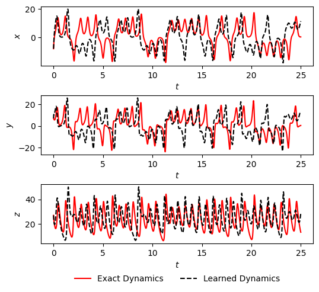

# Solving the Lorenz System with Physics-Informed Neural Networks (PINNs)


---

## 📖 Table of Contents

-   [1. Project Overview](#1-project-overview)
-   [2. The Lorenz System: A Primer on Chaos](#2-the-lorenz-system-a-primer-on-chaos)
-   [3. Methodology: Multistep PINNs](#3-methodology-multistep-pinns)
-   [4. Key Results and Analysis](#4-key-results-and-analysis)
-   [5. How to Run This Project](#5-how-to-run-this-project)
-   [6. Technologies Used](#6-technologies-used)

---

## 1. Project Overview

This project explores an innovative approach to nonlinear system identification by applying **Physics-Informed Neural Networks (PINNs)** to solve the **Lorenz system**, a classic example of chaotic dynamics. The goal is to leverage the power of deep learning to discover the underlying differential equations governing the system directly from sparse and potentially noisy temporal data.

The core of this work lies in combining classical multistep time-stepping schemes (like the Backward Differentiation Formula - BDF) with neural networks. This method allows the model to learn the system's dynamics without requiring explicit calculations of temporal gradients, a common challenge in traditional PINN implementations.

This repository contains the full implementation in a Jupyter Notebook, including:
-   A theoretical introduction to the Lorenz system and its stability analysis.
-   The implementation of the multistep PINN architecture.
-   An analysis of model performance by varying network structure and hyperparameters.
-   A comparison of the predicted trajectories against the ground truth.

---

## 2. The Lorenz System: A Primer on Chaos

The Lorenz system is a set of three coupled, nonlinear ordinary differential equations (ODEs) famous for its "butterfly effect" — a high sensitivity to initial conditions. It is a deterministic system, yet its long-term behavior is chaotic and unpredictable, making it a perfect testbed for advanced system identification methods.

The system is defined by:
$$
\begin{cases}
\frac{dx}{dt} = \sigma (y - x) \\
\frac{dy}{dt} = x (\rho - z) - y \\
\frac{dz}{dt} = x y - \beta z
\end{cases}
$$

Where $\sigma$, $\rho$, and $\beta$ are system parameters. In this project, we analyze the stability of the system's fixed points and explore its behavior for the classic parameters ($\sigma=10, \rho=28, \beta=8/3$) that give rise to the well-known Lorenz attractor.


---

## 3. Methodology: Multistep PINNs

To identify the dynamics of the system, we frame the problem as a nonlinear regression task. We approximate the unknown function $\boldsymbol{f}$ in the general dynamical system $\frac{d\boldsymbol{x}}{dt} = \boldsymbol{f}(\boldsymbol{x}(t))$ using a Fully Connected Neural Network (FCN).

The key innovation is to embed a **multistep numerical scheme** directly into the loss function. For an M-step method, the residual is defined as:
$$
\boldsymbol{y}_n := \sum_{m=0}^M[\alpha_m\boldsymbol{x}_{n-m}+\Delta t \beta_m\boldsymbol{f}_{\theta}(\boldsymbol{x}_{n-m})]
$$
where $\boldsymbol{f}_{\theta}$ is the function approximated by our neural network with parameters $\theta$.

The network is then trained by minimizing a loss function based on the mean squared error of these residuals:
$$
\text{Loss} := \frac{1}{N-M+1}\sum_{n=M}^N\|\boldsymbol{y}_n\|^2
$$

This approach forces the network to learn a function $\boldsymbol{f}_{\theta}$ that satisfies the discretized form of the differential equations, effectively "informing" the network with the laws of physics.

---

## 4. Key Results and Analysis

The Jupyter Notebook presents a detailed analysis of the model's performance. We investigated how the network's architecture and the order of the multistep scheme (`M`) affect the final accuracy.

### Key Findings:
-   **Network Size:** Increasing the number of neurons per layer generally improves the model's ability to capture the system dynamics, reducing both prediction error and minimum training loss. An architecture with 5 hidden layers and 80 neurons per layer was found to offer a good trade-off between accuracy and training stability.
-   **Multistep Order (`M`):** Higher orders of the BDF scheme (larger `M`) consistently led to better convergence and lower final errors, demonstrating the effectiveness of incorporating more historical data points into the loss calculation.
-   **Trajectory Prediction:** The trained model successfully captures the characteristic butterfly shape of the Lorenz attractor, providing accurate long-term predictions even from limited initial data.


*Comparison between the true Lorenz trajectory (blue) and the PINN prediction (orange), showing excellent agreement.*

---

## 5. How to Run This Project

### Prerequisites
To run the Jupyter Notebook, you will need a Python environment with the following libraries installed. It is highly recommended to use a virtual environment.

-   Python 3.7+
-   tensorflow 1.14
-   NumPy
-   Matplotlib

You can install the necessary packages using `pip`:
```bash
pip install torch numpy matplotlib jupyter
